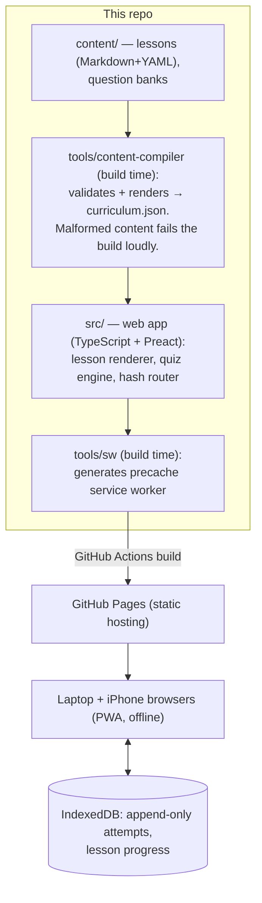

# Metal — a self-contained MLSys learning platform

**Live app: https://mofchris.github.io/bare-metal/** — open it on a phone,
"Add to Home Screen," and it works fully offline after the first load.

Metal is a study tool I'm building for myself: an offline-capable web app
that teaches Machine Learning Systems through sourced lessons, quizzes with
immediate feedback (spaced repetition arriving in Stage B), hands-on labs
measured on my own laptop (Stage C), and in-browser simulators for the
hardware I don't have (Stage D). Built ahead of a US MSc (Fall 2027).

It is also, deliberately, a portfolio piece: the repo's history, decision log,
and session log show how it was actually built, gate by gate.

## What works today (Stage A)

- **Module 1 — Hardware foundations**: 5 authored lessons (memory hierarchy,
  CPU architecture, the three budgets, the roofline model, GPUs), every
  lesson carrying sources; 22-question quiz bank
- **Quiz engine**: MCQ + short answer, immediate feedback with explanations
- **Progress persistence**: every answer is written to IndexedDB the moment
  it's graded — killing the app mid-quiz loses nothing
- **Offline-first PWA**: a hand-rolled ~60-line service worker precaches the
  app and content; installable on iOS/Android home screens

## Running it yourself

Prerequisites: [Node.js](https://nodejs.org) ≥ 22.18 (the build runs
TypeScript tools with Node's native type-stripping). Any OS.

```bash
git clone https://github.com/mofchris/bare-metal.git
cd bare-metal
npm ci          # install exact locked dependencies
npm test        # 30 tests: grading, content validation, persistence, SW generation
npm run dev     # compile content + start dev server (URL printed; append /bare-metal/)
npm run build   # full production build into dist/ (content → typecheck → bundle → sw)
npm run preview # serve the production build locally
```

If `npm run build` fails with "Content compilation failed," that's the
content compiler doing its job — the message names the file and the problem.

## How it's put together

Three parts; no server exists at runtime anywhere:



1. **Authoring**: lessons and questions live in `content/` as Markdown + YAML
   — human-writable, git-diffable, every lesson forced to cite sources.
2. **Build**: the content compiler validates everything against
   [docs/DATA_MODEL.md](docs/DATA_MODEL.md) and emits pre-rendered JSON. A
   typo in a question bank breaks the build, not a study session. CI runs
   format check + tests before every deploy.
3. **Study**: fully client-side; the service worker makes it work offline.
   Quiz attempts append to IndexedDB immediately (that's why mid-quiz crashes
   lose nothing). Lab results (Stage C) will arrive as imported JSON files —
   still no server.

## Project documents

| Document                                 | What it covers                                                   |
| ---------------------------------------- | ---------------------------------------------------------------- |
| [BUILD_PLAN.md](BUILD_PLAN.md)           | Stages, deliverables, approval gates — the process contract      |
| [DECISIONS.md](DECISIONS.md)             | Every non-trivial decision, numbered, with rejected alternatives |
| [SESSION_LOG.md](SESSION_LOG.md)         | Append-only log of every working session                         |
| [docs/CURRICULUM.md](docs/CURRICULUM.md) | Full module → lesson → lab outline (M1–M10)                      |
| [docs/DATA_MODEL.md](docs/DATA_MODEL.md) | Content formats and the progress schema                          |
| [docs/RISKS.md](docs/RISKS.md)           | Top 5 risks and mitigations                                      |

## Repo layout

```
content/   curriculum sources (Markdown lessons, YAML question banks)
src/       the app: components/ (screens), lib/ (routing, grading, storage)
tools/     build-time tools: content-compiler/, sw/ (service worker), icons/
docs/      design documents
public/    static assets (manifest, icons) + generated curriculum.json
```
