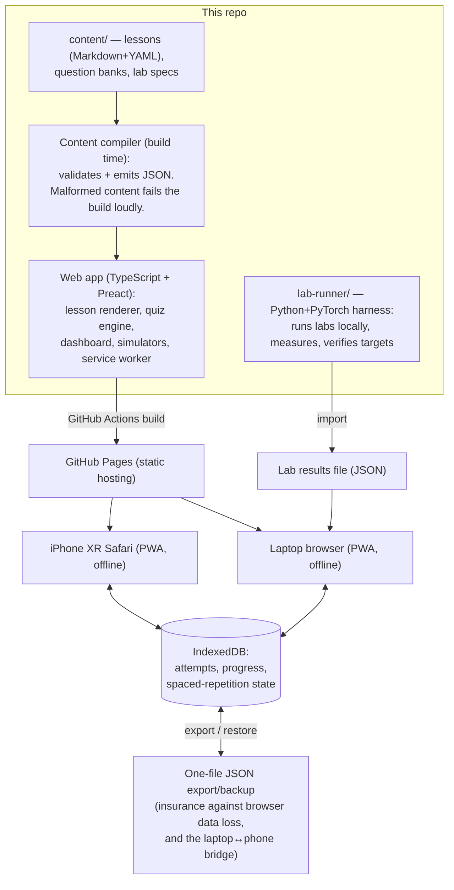

# Metal — a self-contained MLSys learning platform

A study tool I'm building for myself: an offline-capable web app that teaches
Machine Learning Systems through lessons, quizzes with spaced repetition,
hands-on labs measured on my own laptop, and in-browser simulators for the
hardware I don't have. Built ahead of a US MSc (Fall 2027).

**Status: Stage 0 — Discovery & Design.** No code yet; this stage produces the
design documents below. The build process (stages, approval gates, decision
log) is defined in [BUILD_PLAN.md](BUILD_PLAN.md).

## Design documents

| Document | What it covers |
|---|---|
| [BUILD_PLAN.md](BUILD_PLAN.md) | Stages, deliverables, approval gates |
| [DECISIONS.md](DECISIONS.md) | Every non-trivial decision, numbered, with rejected alternatives |
| [docs/CURRICULUM.md](docs/CURRICULUM.md) | Full module → lesson → lab outline, dependency-ordered |
| [docs/DATA_MODEL.md](docs/DATA_MODEL.md) | Curriculum format, question bank format, progress schema |
| [docs/RISKS.md](docs/RISKS.md) | Top 5 risks and mitigations |
| [SESSION_LOG.md](SESSION_LOG.md) | Append-only log of every working session |

## Architecture overview

The whole system is three parts: a **static web app** (the study tool), a
**content pipeline** (turns Markdown lessons into validated JSON at build
time), and a **lab-runner** (Python scripts that run experiments on my laptop
and hand results back to the app as a file).

There is no server at runtime. GitHub Pages serves static files; everything
else happens on my devices.

### How data flows

1. **Authoring:** lessons, questions, and lab specs live in `content/` as
   Markdown + YAML — human-writable, git-diffable.
2. **Build:** the content compiler validates everything against the schemas in
   [docs/DATA_MODEL.md](docs/DATA_MODEL.md) and emits JSON the app loads.
   A typo in a question bank breaks the build, not a study session.
3. **Study:** the app runs entirely client-side. A hand-rolled service worker
   precaches the app and content on first load, so it works with no internet.
4. **Progress:** every quiz attempt and lesson completion is written to
   IndexedDB. A one-file export/restore is the safety net (browsers — iOS
   Safari especially — can evict local data) and the way progress moves
   between laptop and phone in v1.
5. **Labs:** the lab-runner runs experiments locally (real timing, real
   memory), writes a results JSON, and the app imports it — no server needed.

### Why these choices

Each stack choice, with the alternatives it beat and why, is a numbered entry
in [DECISIONS.md](DECISIONS.md) (D-001 through D-010). Short version: fewest
moving parts that satisfy four hard constraints — static hosting, offline
after first load, a 16 GB laptop with no discrete GPU, and an iPhone XR as
the second screen.
